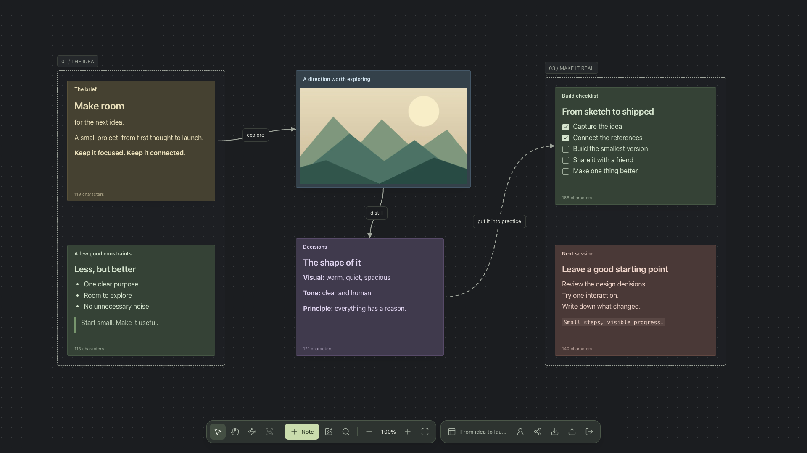

<div align="center">

# Notes

**An encrypted canvas for connected ideas.**

Notes, images, Markdown, and a little room to think.\
Self-hostable. No email or password required.

[**Open Notes →**](https://notes.wlt.sh) · [Self-host](#self-hosting) · [Encryption](docs/encryption.md) · [Contributing](CONTRIBUTING.md)

[](LICENSE)
[](https://nodejs.org/)

</div>



<sub>A real 1920 × 1080 app screenshot with fictional content. [Reproduce this demo](docs/demo.md).</sub>

## A board that stays out of the way

- **Think spatially.** An infinite dotted canvas with grid snapping, resizable notes, groups, and labeled solid or dashed connections.
- **Write and connect.** Markdown with clickable task lists, formatting shortcuts, board search, and `@` mentions that create connections automatically.
- **Keep visual references.** Drop in images, move them like notes, and download the stored version from their header.
- **Work together.** Invite people by UID as editors or viewers. See their cursors, selections, and movements in real time.
- **Control access.** Passkey or generated access-key sign-in, encrypted private boards, pinned notes, and separately locked note contents.
- **Share deliberately.** Publish a read-only, unencrypted snapshot without giving visitors access to your private board.
- **Feel at home.** Automatic light/dark themes and English/Russian UI selected from browser language preferences. Each board remembers your camera position locally.

Each account can own **3 boards**. Each board supports **10 participants**, including its owner. The storage quota defaults to **200 MB per board**, configurable with `BOARD_LIMIT_MB`.

## Sign in

Open [notes.wlt.sh](https://notes.wlt.sh), or your own instance, and choose:

| Method | How it works |
| --- | --- |
| **Passkey** | Uses WebAuthn for authentication and the PRF extension to derive encryption keys in your browser. Requires a compatible browser, authenticator, and passkey provider. |
| **Access key** | Generates a random 256-bit key in your browser. Save it in a password manager and use it to sign in on another supported device. Useful when WebAuthn PRF is unavailable. |

These methods create separate accounts; they are not interchangeable recovery methods. There is no email-based account recovery. **Keep your original passkey or access key.** Reloading a tab preserves an active session when browser storage is available; visible user activity extends it for another 12 hours.

## Self-hosting

Notes runs as **one Node.js process** serving the frontend, API, and WebSocket endpoint. No separate database service, Redis, or object-storage service is required.

```sh
git clone https://gitlab.wiolett.net/wiolett/notes.git
cd notes
docker build -t notes .

docker run -d --name notes --restart unless-stopped \
  -p 127.0.0.1:3001:3001 \
  -e ORIGIN=https://notes.example.com \
  -e RP_ID=notes.example.com \
  -e DATABASE_PATH=/data/notes.sqlite \
  -e IMAGES_PATH=/data/images \
  -e BOARD_LIMIT_MB=200 \
  -v notes-data:/data \
  notes
```

Put an HTTPS reverse proxy in front of port 3001 and forward WebSocket upgrades for `/socket`. Use your actual public domain for both `ORIGIN` and `RP_ID`. Passkeys are tied to that domain; changing it does not migrate existing passkeys.

### Configuration

| Variable | Default | Purpose |
| --- | --- | --- |
| `ORIGIN` | `http://localhost:5173` in development; required in production | Exact browser origin, including scheme and any port, without a trailing slash. |
| `RP_ID` | `localhost` in development; required in production | Passkey relying-party ID. Must equal the hostname in `ORIGIN`. |
| `HOST` | `127.0.0.1`; `0.0.0.0` in Docker | Bind address. |
| `PORT` | `3001` | Frontend, API, and WebSocket port. |
| `DATABASE_PATH` | `data/quiet.sqlite` locally; `/data/notes.sqlite` in Docker | SQLite database file. |
| `IMAGES_PATH` | `data/images` locally; `/images` in Docker | Encrypted image files and explicitly published snapshots. The example above stores both under the single `/data` volume. |
| `BOARD_LIMIT_MB` | `200` | Per-board storage quota in decimal MB: 1 MB = 1,000,000 bytes. |
| `NODE_ENV` | Unset locally; `production` in Docker | Production requires HTTPS and explicit origin/RP configuration. |

Storage accounting uses **the stored encrypted bytes**, not the original upload size. A 10 KB image that becomes a 20 KB `.enc` file consumes 20 KB, plus its board metadata. Public snapshots also count. Transport allowances are derived from the configured quota; there is no separate fixed 300 MB board limit. Changing the environment requires restarting the server and reloading open clients to fetch its configuration.

The container runs as UID/GID **1000:1000**. Mounted directories must be writable by that user. Health check: `GET /api/health`.

### Backups and updates

Back up **both SQLite and the image directory together**. Stop the container before copying the volume to keep database references and files consistent; retain the SQLite WAL files if present. Keep the volume when replacing the container.

The toolbar's encrypted export is a per-board backup, not an account recovery method. It requires the original board's key. Restoring a backup replaces that board's content after confirmation.

## How privacy works

Private board data is encrypted in the browser. Each board has its own random AES-256 key; notes, positions, groups, and connections are encrypted separately so updates send only changed entities. Image ciphertext is stored as files rather than SQLite blobs.

Inviting someone wraps the board key with that person's RSA-OAEP public key. The server enforces editor/viewer permissions and relays encrypted collaboration messages. Locked note contents use a separate key hierarchy; titles remain visible to board members.

**Publishing is an explicit privacy boundary.** A public link serves a plaintext snapshot stored on the server. It does not reveal the live private board, and later edits do not update the snapshot. Disable publishing to remove it from the server; copies already downloaded by visitors cannot be recalled.

Encryption does not hide membership, roles, object sizes, identifiers, revisions, or activity from the server. It also does not protect an unlocked browser from malicious extensions or a compromised application host. Removing a participant blocks future server access but does not rotate the board key or erase data they already received.

Read the [encryption design, key hierarchy, and limitations](docs/encryption.md). Notes has **not undergone an independent security audit**. For vulnerability reports, see [SECURITY.md](SECURITY.md).

## Keyboard shortcuts

Shortcuts apply while the canvas is focused. Text editing keeps its normal keyboard behavior.

| Action | Shortcut |
| --- | --- |
| Select / pan / connect | `V` / `H` / `C` |
| Cycle tools | `Ctrl` / `Cmd` + `Space` |
| New note / group selection | `N` / `G` |
| Select an area | `Shift` + drag |
| Select all / clear selection | `Ctrl` / `Cmd` + `A` / `D` |
| Copy / cut / paste notes | `Ctrl` / `Cmd` + `C` / `X` / `V` |
| Delete selection | `Backspace` or `Delete` |
| Search / fit board | `Ctrl` / `Cmd` + `F` / `0` |
| Bold / italic / link / inline code | `Ctrl` / `Cmd` + `B` / `I` / `K` / `E` |
| Strikethrough | `Ctrl` / `Cmd` + `Shift` + `X` |

## Development

Requires **Node.js 24.13+** and npm.

```sh
npm ci
npm run dev
```

Open `http://localhost:5173`. Vite proxies `/api` and `/socket` to port 3001. Copy `.env.example` to `.env` if you need to override the defaults.

To run the built application on one port:

```sh
npm run build
ORIGIN=http://localhost:3001 RP_ID=localhost npm start
```

```text
apps/web        Preact, Vite, Lucide, Markdown-it, Web Crypto
apps/server     Hono, Node.js SQLite, WebAuthn, WebSockets
packages/shared Shared schemas, limits, and chunked transport
```

```sh
npm run typecheck
npm test
npm run build
```

See [CONTRIBUTING.md](CONTRIBUTING.md) for the development workflow and [the demo guide](docs/demo.md) to reproduce the screenshot.

### Current boundaries

- Up to 10,000 notes, 5,000 groups, and 40,000 connections per board. The interactive group-creation tool currently caps creation at 500 groups.
- Uploads are re-encoded in the browser to at most 1600 pixels on their longest side, usually as WebP. Download retrieves that stored version, not the untouched original.
- Transfers are chunked and rendering is culled to the viewport, but complete snapshots are still assembled in memory. Raising the storage quota also raises memory requirements.
- Concurrent changes merge different objects and fields; conflicting edits to the same field use the last accepted update. This is not character-level collaborative text editing.
- Real-time presence runs in one server process. Multi-instance deployments need additional coordination and are not supported out of the box.

## License

[MIT](LICENSE) — © 2026 Wiolett and contributors. Third-party dependencies retain their own licenses.
